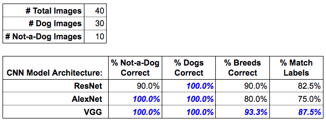

# Using a Pre-trained Image Classifier

[](https://www.python.org/downloads/release/python-3127/)
[](https://pytorch.org/get-started/locally/)
[](LICENSE)

## Overview

In this project, I use a *pre-trained* deep learning model to classify and identify images. The main goal is to showcase my skills in AI programming by efficiently managing data flow and optimizing algorithm performance. I aim to achieve high classification accuracy and evaluate the performance of various neural network architectures. The expected outcomes include developing a robust image classification system and gaining valuable insights into the effectiveness of different models.

The project has the following objectives:

1. Correctly identify which pet images are of dogs (even if the breed is misclassified) and which ones aren't of dogs.
2. Correctly classify the breed of dog, for the images that are of dogs.
3. Determine which CNN model architecture (ResNet, AlexNet, or VGG) **best** achieves objectives 1 and 2.
4. Consider the *time* resources required to best achieve objectives 1 and 2, and determine if an alternative solution would have given a **good enough** result, given the amount of time each of the algorithms takes to run.

## Installation

### Prerequisites

Ensure you have the following installed:

- Python (>=3.12)
- pip

### Steps

1. Clone the repository

    ```sh
    git clone https://github.com/sdtrklse/using-a-pre-trained-image-classifier.git
    cd using-a-pre-trained-image-classifier
    ```

2. Create and activate a virtual environment

    ```sh
    python -m venv demo  # `python3 -m venv demo` on some systems
    source demo/Scripts/activate  # `source demo/bin/activate` on some systems
    ```

3. Install dependencies

    ```sh
    pip install -r requirements.txt
    ```

## Project Structure

This project follows a structured directory layout for better organization and maintainability.

Below is the folder hierarchy:

```sh
project_root/
│── assets/               # Images, diagrams, icons, and other media
│── data/                 # Dataset storage
│── outputs/              # Model artifacts, predictions, reports
│── src/                  # Source code for the project
│── .gitignore            # Files to ignore in version control
│── answers.md            # Answers to project-related questions
│── LICENSE               # License for project usage
│── README.md             # Project documentation
└── requirements.txt      # Python dependencies
```

## Dataset

- **Description:** The pet image files are located in the folder `data/pet-images`. There are 40 total pet images:
    - 30 images of dogs
    - 10 images of animals that aren't dogs
- **Preprocessing Steps:**
    - Image resizing to 256x256
    - Center cropping and tensor conversion
    - Normalization using ImageNet mean and standard deviation

## Model Architecture

I use a CNN that has already *learned* the features from a giant dataset of 1.2 million images called [**ImageNet**](https://www.image-net.org/). There are different types of CNNs that have different structures (architectures) that work better or worse depending on the criteria. Within this project, I explore *three* different architectures and determine which is best for the application. Specifically, I am provided with a classifier function in `classifier.py` that allows me to use these CNNs.

- **Feature Extractors:** AlexNet, ResNet, VGG (pre-trained on ImageNet)
- **Frameworks/Libraries:** PyTorch, torchvision, Pillow, argparse

## Usage

### Running the Project

To run the app with default arguments, you can issue

```sh
python check-images.py
```

from the command line inside the `src` directory. The app will then display the results of the image classification.

To run the app with different arguments, you can issue

```sh
python check_images.py --dir <image_directory> --arch <model_architecture>
```

from the command line inside the `src` directory. The arguments are as follows:

- `--dir`: The directory containing the images to be classified
    - Options: `../data/pet-images/`, `../data/uploaded-images/`
- `--arch`: The CNN model architecture to be used
    - Options: `alexnet`, `resnet`, `vgg`

Additionally, you can run the app with batch processing by issuing

```sh
sh batch-processing/run_models_batch.sh  # for pet images
sh batch-processing/run_models_batch_uploaded.sh  # for uploaded images
```

from the command line inside the `src` directory. The results will be saved in the `outputs` directory.

## Results

- Both VGG and AlexNet correctly identify images of "dogs" and "not-a-dog" 100% of the time.
- VGG provides the best solution because it classifies the correct breed of dog over 90% of the time.

<p align="center">
    
</p>
<p align="center"><em>Results Table</em></p>

Given the results, the "best" architecture is **VGG**. It outperformed both of the other architectures when considering both objectives 1 and 2. ResNet did classify dog breeds better than AlexNet, but only VGG and AlexNet were able to classify "dogs" and "not-a-dog" at **100% accuracy**. The VGG model was the one that was able to classify "dogs" and "not-a-dog" with **100% accuracy** and had the best performance regarding breed classification with **93.3% accuracy**.

## License

This project is licensed under the MIT License - see the [**LICENSE**](LICENSE) file for details.
