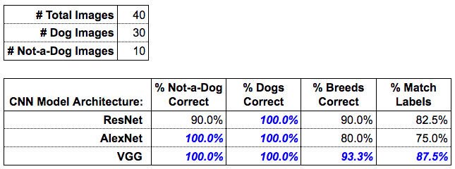

# Image Classification for a City Dog Show

**Project Goal**: Using a pre-trained deep learning model for classification and identification task

This project involves classifying images using different neural network architectures, managing data flow, and timing the execution of algorithms, allowing me to demonstrate my mastery of these Python concepts in AI programming.

## Description

From the Nanodegree project page:

> Your city is hosting a citywide dog show and you have volunteered to help the organizing committee with contestant registration. Every participant that registers must submit an image of their dog along with biographical information about their dog. The registration system tags the images based upon the biographical information.
>
> Some people are planning on registering pets that *aren’t actual dogs*.
>
> You need to use an already developed Python classifier to make sure the participants are dogs.

## Principal Objectives

1. Correctly identify which pet images are of dogs (even if the breed is misclassified) and which pet images aren't of dogs.
2. Correctly classify the breed of dog, for the images that are of dogs.
3. Determine which CNN model architecture (ResNet, AlexNet, or VGG) "**best**" achieve objectives 1 and 2.
4. Consider the *time* resources required to best achieve objectives 1 and 2, and determine if an alternative solution would have given a "**good enough**" result, given the amount of time each of the algorithms takes to run.

## Notes

For this image classification task, I use an image classification application using a deep learning model called a convolutional neural network (often abbreviated as CNN). CNNs work particularly well for detecting features in images like colors, textures, and edges; then using these features to identify objects in the images. I use a CNN that has already *learned* the features from a giant dataset of 1.2 million images called [**ImageNet**](https://www.image-net.org/). There are different types of CNNs that have different structures (architectures) that work better or worse depending on the criteria. With this project, I explore three different architectures (**AlexNet**, **VGG**, and **ResNet**) and determine which is best for the application.

I am provided with a classifier function in `classifier.py` that allows me to use these CNNs to classify the images. For this project, I am focusing on using the Python skills to complete these tasks using the `classifier` function.

Certain breeds of dogs look very similar. The more images of two similar-looking dog breeds that the algorithm has *learned* from, the more likely the algorithm will be able to distinguish between those two breeds. The following breeds look very similar: [**Great Pyrenees**](https://www.google.com/search?q=Great+Pyrenees&source=lnms&tbm=isch&sa=X&ved=0ahUKEwje252-kpfZAhVF3FMKHeXwB3IQ_AUICigB&biw=1112&bih=1069) and [**Kuvasz**](https://www.google.com/search?tbm=isch&q=Kuvasz&spell=1&sa=X&ved=0ahUKEwi9_9fTkpfZAhWB7FMKHXlKDWoQBQg6KAA&biw=1112&bih=1069&dpr=1), [**German Shepherd**](https://www.google.com/search?biw=1112&bih=1069&tbm=isch&sa=1&ei=d7F8WpaaMc_VzgLW8LvABw&q=German+Shepherd&oq=German+Shepherd&gs_l=psy-ab.3..0i67k1j0l2j0i67k1j0l6.31751.41069.0.41515.29.18.4.7.9.0.131.1164.14j2.17.0....0...1c.1.64.psy-ab..2.26.1140.0..0i10k1j0i13k1.112.xUB8_AoVF9w) and [**Malinois**](https://www.google.com/search?biw=1112&bih=1069&tbm=isch&sa=1&ei=orF8WtHWDcOdzwLnyLXgBw&q=Malinois&oq=Malinois&gs_l=psy-ab.3..0l3j0i67k1l3j0l2j0i67k1j0.31864.42125.0.42493.23.20.0.1.1.0.132.1460.14j4.19.0....0...1c.1.64.psy-ab..8.14.926.0...75.U5aOu6JZ9Vk), [**Beagle**](https://www.google.com/search?biw=1112&bih=1069&tbm=isch&sa=1&ei=zbF8WqTiHZDxzgKlm5SYBw&q=Beagle&oq=Beagle&gs_l=psy-ab.3..0i67k1j0l2j0i67k1l2j0l5.29396.33482.0.34041.12.8.3.1.1.0.126.585.6j2.8.0....0...1c.1.64.psy-ab..0.12.609...0i10k1.0.Dr92CW2Kqqo) and [**Walker Hound**](https://www.google.com/search?biw=1112&bih=1069&tbm=isch&sa=1&ei=8LF8WteAGND0zgKvlL-IBw&q=Walker+hound&oq=Walker+hound&gs_l=psy-ab.3..0l10.20697.23454.0.23773.12.10.0.2.2.0.81.601.10.10.0....0...1c.1.64.psy-ab..0.12.610...0i67k1.0.GI0QxI1sadY), amongst others.

## Results

- For objective 1, both VGG and AlexNet correctly identify images of "dogs" and "not-a-dog" 100% of the time.
- For objective 2, VGG provides the best solution because it classifies the correct breed of dog over 90% of the time.

<p align="center">
    
</p>
<p align="center"><em>Results Table</em></p>

Given the results, the "best" model architecture is **VGG**. It outperformed both of the other architectures when considering both objectives 1 and 2. ResNet did classify dog breeds better than AlexNet, but only VGG and AlexNet were able to classify "dogs" and "not-a-dog" at **100% accuracy**. The model VGG was the one that was able to classify "dogs" and "not-a-dog" with **100% accuracy** and had the best performance regarding breed classification with **93.3% accuracy**.

## Dependencies

To install dependencies with pip, one can issue `pip install -r requirements.txt`.

## How to Run the App

To run the app with default arguments, one can issue

```shell
python check-images.py
```

from the command line inside the `project-files` directory. The app will then display the results of the image classification process.

To run the app with different arguments, one can issue

```shell
python check_images.py --dir <image_directory> --arch <model_architecture>
```

from the command line inside the `project-files` directory. The arguments are as follows:

- `--dir`: The directory containing the images to be classified.
  - Options: `pet-images/`, `uploaded-images/`
- `--arch`: The CNN model architecture to be used.
  - Options: `alexnet`, `vgg`, `resnet`

Additionally, one can run the app with batch processing by issuing

```shell
sh batch-processing/run_models_batch.sh # for pet images, or
sh batch-processing/run_models_batch_uploaded.sh # for uploaded images
```

from the command line inside the `project-files` directory. The results will be saved in the `outputs` directory.
